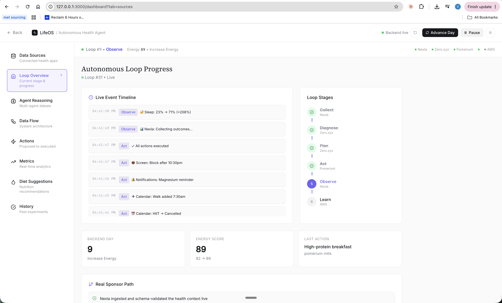
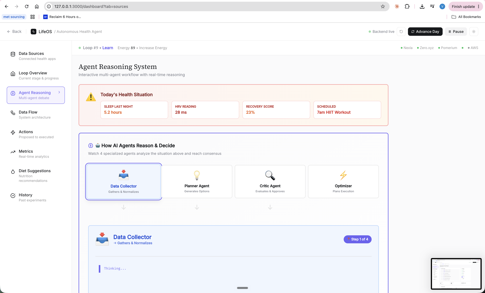
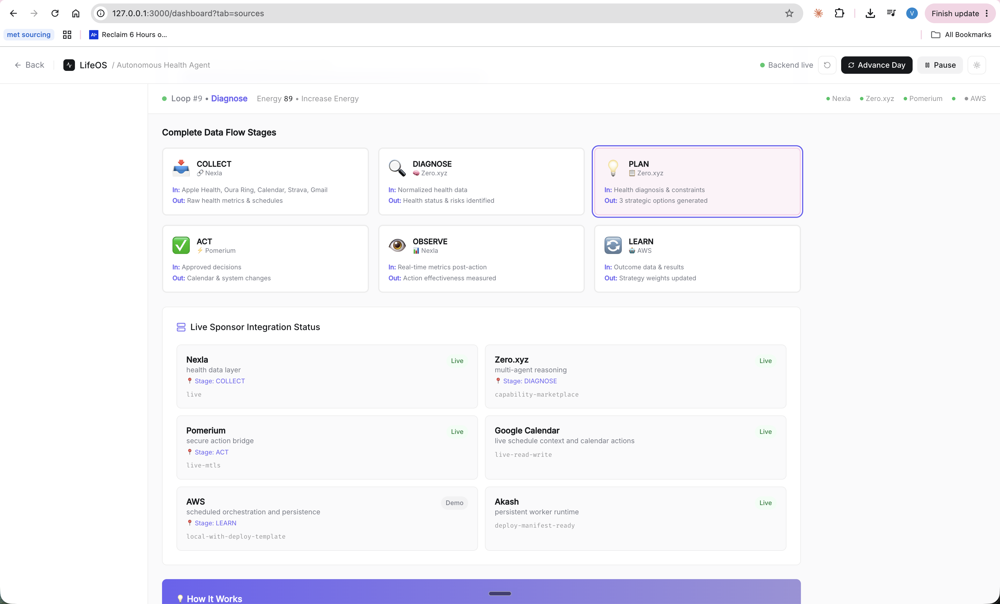
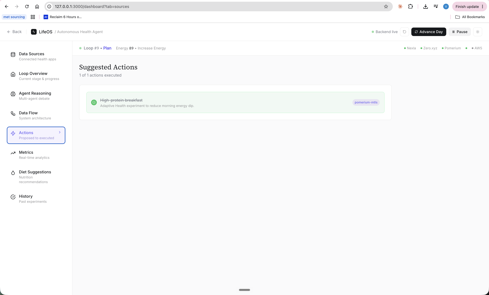
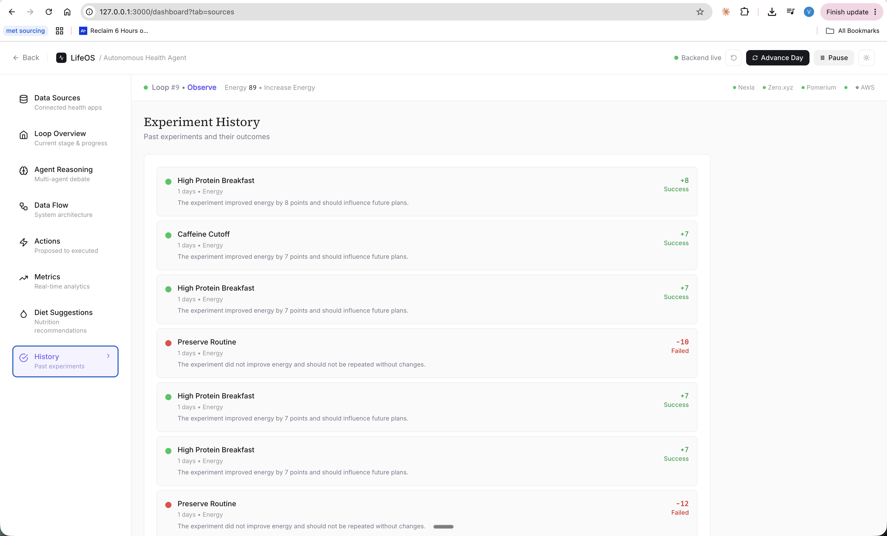
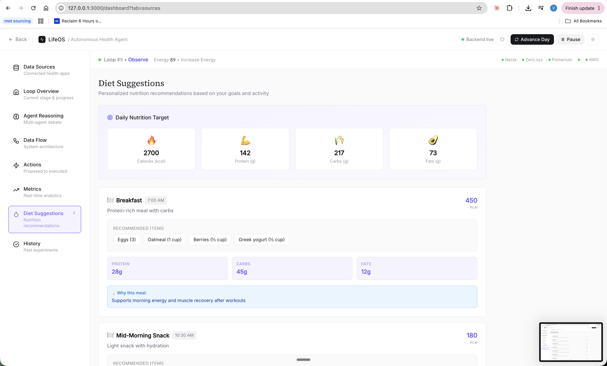

# LifeOS: Autonomous Health Optimization Agent

LifeOS is an autonomous health agent that closes the loop between health data, reasoning, and action. Instead of only recommending what a user should do, it observes daily signals, diagnoses the bottleneck, proposes an experiment, executes a safe action, measures the next-day outcome, and remembers what worked.

Built for the Loop Engineering Hackathon, LifeOS is designed to showcase a real sponsor-backed agent workflow:

```text
Collect -> Diagnose -> Plan -> Act -> Observe -> Learn
```

## What It Does

LifeOS optimizes for a user's health goal, currently `increase_energy`, by combining wearable-style metrics, schedule context, AI reasoning, and secure action execution.

The demo starts with loop history already built up, so judges can see that the system has been learning across days. A live run can then advance the next day and show:

- Health context collected and normalized
- Multi-agent diagnosis of the current bottleneck
- A proposed one-day intervention
- Action execution through a secured bridge
- Outcome evaluation and memory update
- Sponsor integration status for each part of the loop

## Why It Matters

Most health apps stop at dashboards and recommendations. LifeOS demonstrates what comes next: an agent that can responsibly act on behalf of the user.

Examples:

- If recovery is low and the calendar is packed, LifeOS can move a workout.
- If late caffeine hurts sleep, it can create a reminder.
- If protein intake is the bottleneck, it can propose a nutrition intervention.
- If an action touches a sensitive service, it goes through Pomerium before execution.

## Sponsor Integrations

| Sponsor / Platform | Role | Current Status |
| --- | --- | --- |
| Nexla | Health/context data layer | Live ingest and schema verification |
| Zero.xyz | Multi-agent reasoning marketplace | Live diagnostician calls with fallback |
| Pomerium | Secure action bridge | Live self-hosted mTLS proxy |
| Google Calendar | Live schedule context and calendar writes | Live read/write OAuth integration |
| AWS | Scheduled orchestration and persistence path | Deployed Lambda/DynamoDB/EventBridge path |
| Akash | Persistent decentralized runtime | Deployment manifest and live deployment path |

The app uses deterministic demo health metrics where real wearable credentials are not available, but the orchestration path and sponsor integrations are real implementation surfaces. Google Calendar is connected as a real user data source and can create real calendar events.

## Architecture

```text
Frontend Dashboard (Next.js)
        |
        v
Next API Proxy (/api/adaptive-health/*)
        |
        v
Adaptive Health Backend (Node.js)
        |
        +--> Nexla: ingest + schema validation
        +--> Zero.xyz: live diagnosis capability call
        +--> Google Calendar: read schedule context
        +--> Pomerium: mTLS-gated action bridge
        +--> AWS/Akash: deployable autonomous runtime paths
```

The backend stores local demo state in `data/adaptive-health-state.json` during development. In the AWS deployment path, state can be persisted through DynamoDB.

## Repository Layout

```text
.
├── src/                         # Backend agent loop and integrations
│   ├── app.js                   # Application orchestration API
│   ├── server.js                # Local HTTP server
│   ├── core/                    # Agent loop, state, and demo health context
│   ├── integrations/            # Nexla, Zero, Pomerium, Google Calendar, AWS, Akash
│   ├── services/                # Pomerium-protected action upstream
│   └── storage/                 # Local file / DynamoDB state storage
├── frontend/                    # Next.js dashboard and landing page
├── infra/                       # Pomerium and AWS deployment assets
├── docs/                        # API docs, integration notes, screenshots
├── test/                        # Node test suite
├── Dockerfile                   # Container image for Akash/deployments
└── deploy.akash.yaml            # Akash SDL
```

## Local Demo

Start the backend:

```bash
cd /Users/magichour/Documents/LifeOS/aws-hackathon
npm install
npm run dev
```

Start the frontend in another terminal:

```bash
cd /Users/magichour/Documents/LifeOS/aws-hackathon/frontend
npm install
npm run dev
```

Open the dashboard:

```text
http://127.0.0.1:3000/dashboard
```

Useful backend URLs:

```text
GET  http://127.0.0.1:8787/health
GET  http://127.0.0.1:8787/api/state
GET  http://127.0.0.1:8787/api/integrations/status
GET  http://127.0.0.1:8787/api/google-calendar/events?date=YYYY-MM-DD
POST http://127.0.0.1:8787/api/advance-day
POST http://127.0.0.1:8787/api/google-calendar/test-write
```

## Demo Script

1. Open the dashboard at `/dashboard`.
2. Show the top bar: backend live, current loop number, current energy score.
3. Open **Data Flow** and point out the sponsor path:
   - Nexla collects and normalizes context.
   - Zero.xyz powers diagnosis.
   - Pomerium gates actions.
   - Google Calendar is live read/write.
   - AWS and Akash show deployable runtime paths.
4. Open **Agent Reasoning** to show the multi-agent decision process.
5. Open **Actions** to show what the agent executed.
6. Open **History** to show memory from prior experiments.
7. Click **Advance Day** to run a new loop live.
8. For guaranteed Google Calendar write proof, call:

```bash
curl -X POST http://127.0.0.1:8787/api/google-calendar/test-write
```

Then verify the event:

```bash
curl "http://127.0.0.1:8787/api/google-calendar/events?date=2026-07-17"
```

## Google Calendar Setup

LifeOS can read from and write to a real Google Calendar.

In Google Cloud Console:

1. Enable the Google Calendar API.
2. Create an OAuth web client.
3. Add this authorized redirect URI:

```text
http://127.0.0.1:8787/auth/google/callback
```

In `.env`:

```text
GOOGLE_CLIENT_ID=<oauth-client-id>
GOOGLE_CLIENT_SECRET=<oauth-client-secret>
GOOGLE_REDIRECT_URI=http://127.0.0.1:8787/auth/google/callback
GOOGLE_TOKEN_PATH=./data/google-calendar-token.json
GOOGLE_CALENDAR_ID=primary
GOOGLE_CALENDAR_TIME_ZONE=America/Los_Angeles
GOOGLE_CALENDAR_WRITE_ENABLED=true
```

Restart the backend, then open:

```text
http://127.0.0.1:8787/auth/google
```

When connected, `/api/integrations/status` should show:

```json
{
  "mode": "live-read-write",
  "connected": true,
  "writeEnabled": true
}
```

## Environment

Copy `.env.example` to `.env` and fill only the services you want to run live. Missing credentials fall back to deterministic demo behavior where possible.

Important local secrets are ignored by git:

- `.env`
- `data/*.json`
- `infra/pomerium/certs/`

## Validation

Backend tests:

```bash
npm test
```

Frontend build:

```bash
cd frontend
npm run build
```

## Deployment Paths

AWS:

- `src/lambda.js` exposes the Lambda handler.
- `infra/aws/template.yaml` defines Lambda, DynamoDB, and EventBridge Scheduler.
- Local state uses a JSON file; deployed state can use DynamoDB.

Akash:

- `Dockerfile` builds the backend container.
- `deploy.akash.yaml` defines the Akash deployment.
- The app is designed to keep the loop running beyond a browser session.

## Screenshots

### Loop Overview



### Agent Reasoning



### Data Flow and Sponsor Status



### Actions



### Experiment History



### Diet Suggestions



